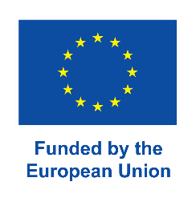

# DIAMOND Horizon Project

The **DIAMOND Horizon Project** is an EU-funded initiative under the Horizon Europe program. It aims to revolutionize the field of photovoltaics by developing **ultra-stable, highly efficient, and low-cost solar cells** with a focus on minimizing environmental impact and maximizing sustainability.

## About the Project

DIAMOND is structured into comprehensive work packages, each targeting specific facets of perovskite photovoltaic (PV) technology:

- **Materials Optimization**: Enhancing absorber layers, hole and electron transport materials, and electrode deposition techniques to improve overall device performance.

- **High-Efficiency Solar Cells**: Achieving power conversion efficiencies (PCE) of ≥27%, stability over 5,000 hours for small-area perovskite solar cells (PSCs), reducing lead content, and optimizing carbon-based PSCs.

- **Module Development**: Developing scalable printing techniques for full-stack modules, aiming for carbon-based modules up to 100 cm² with PCE ≥18% and large-area modules up to 500 cm² with PCE ≥16%, fabricated outside glovebox environments.

- **Packaging & Encapsulation**: Implementing advanced laser-assisted sealing methods, polymeric sealing for PSC modules, and lead sequestration layers to enhance device longevity and safety.

- **Stability Assessment**: Evaluating material aging, intrinsic and extrinsic degradation mechanisms, and outdoor stability to ensure long-term performance.

- **Sustainability**: Conducting life cycle, techno-economic, and social assessments of PSC module production, focusing on low environmental impact, critical materials assessment, and design for recycling.

## Learn More

To dive deeper into the project, please visit the official resources:
- **[Project Website](https://diamond-horizon.eu/)**  
  Explore detailed project information, news, and updates.
- **[CORDIS Project Page](https://cordis.europa.eu/project/id/101084124/results/de)**  
  Access official EU project documentation, deliverables, and outcomes.

---

Funded by the European Union. Views and opinions expressed are those of the author(s) only and do not necessarily reflect those of the European Union or Horizon Europe program under Grant Agreement No. 101084124. The European Union is not responsible for any use that may be made of the information it contains.